# Test Build Flows Documentation

## 🔄 Test Build Flows Overview

```mermaid
graph TD
    A[Developer Creates PR] --> B{Fingerprint Check}
    B -->|No Native Changes| C[📦 OTA to Preview]
    B -->|Native Changes| D[🏗️ Build Apps]
    
    C --> E[Team with Preview Builds Test]
    D --> F[Team Downloads & Tests]
    
    E --> G[Merge PR]
    F --> G[Merge PR]
    
    G --> H[Preview Channel Updated]
    H --> I[Test 1-2 Days]
    I --> J[Promote to Production]
```



## Flow 1: JavaScript-Only Changes (Most Common)


### Example Trigger:
```bash
# You change a React component
git checkout -b strukturedkaos/fix-chat-ui
vim components/Chat.tsx  # Fix UI issue
git commit -m "fix: Chat scroll position"
git push origin strukturedkaos/fix-chat-ui
# Create PR → OTA deploys automatically
```

### What Team Sees:
```
PR Comment:
🚀 Preview OTA Update Deployed!
- JavaScript-only changes detected
- Update available on preview channel
- Force close and reopen app to get update
```

### Timeline:
- PR Created: 0 min
- Fingerprint Check: 1 min
- OTA Deployed: 2-3 min
- **Total: ~3 minutes**

## Flow 2: Native Changes (Needs New Build)


### Example Trigger:
```bash
# You add a native package
git checkout -b strukturedkaos/add-camera
npm install react-native-vision-camera
git commit -m "feat: Add camera support"
git push origin strukturedkaos/add-camera
# Create PR → Builds start automatically
```

### What Team Sees:
```
PR Comment:
📱 Preview Builds Ready!

🤖 Android: [Download APK](link)
🍎 iOS: [Install on iPhone](link)
   - Requires registered device

Native changes detected - new builds created
```

### Timeline:
- PR Created: 0 min
- Fingerprint Check: 1 min
- Build Start: 2 min
- Android Build: 10-15 min
- iOS Build: 15-20 min
- **Total: ~20 minutes**

## Flow 3: Manual Preview → Production


### Trigger Command:
```bash
# After preview testing is complete
gh workflow run preview-to-production.yml

# Or skip approval for hotfix
gh workflow run preview-to-production.yml -f skip-approval=true
```

### What Happens:
1. Latest preview update identified
2. Test summary generated
3. Approval requested (if not skipped)
4. Update republished to production
5. Error monitoring for 5 minutes
6. Auto-rollback if error rate > 5%

## Flow 4: Scheduled Weekly Review


### Automatic Trigger:
```yaml
# Runs automatically every Wednesday
schedule:
  - cron: '0 10 * * 3'
```

### Purpose:
- Regular cadence for production updates
- Batches multiple preview changes
- Ensures preview gets promoted

## 🎯 Quick Decision Tree

```mermaid
graph TD
    A[Making Changes?] --> B{What Changed?}
    B -->|JS/TS/Assets| C[✅ OTA Update]
    B -->|package.json| D{Native Deps?}
    B -->|app.json plugins| E[❌ Need Build]
    B -->|iOS/Android folders| E
    
    D -->|Yes| E
    D -->|No| C
    
    C --> F[Preview Channel]
    E --> G[New Builds Created]
    
    F --> H[Test → Production]
    G --> I[Download & Test]
```



## 📊 Testing Environments

```
┌─────────────────────────────────────────┐
│            PRODUCTION                   │
│         (Live App Users)                │
│         Channel: production             │
└────────────────▲────────────────────────┘
                 │ Promote (Manual)
┌────────────────┴────────────────────────┐
│            PREVIEW                      │
│     (Team Testing - All PRs)           │
│         Channel: preview                │
└────────────────▲────────────────────────┘
                 │ Automatic
┌────────────────┴────────────────────────┐
│         PULL REQUESTS                  │
│    (Individual Features/Fixes)         │
└─────────────────────────────────────────┘
```

## 🔍 How to Check What Will Happen

### Before Creating PR:
```bash
# Check if your changes will trigger a build
npx @expo/fingerprint . --platform ios

# Compare with main branch
git checkout main
npx @expo/fingerprint . --platform ios
git checkout -

# If fingerprints differ = builds will be created
```

### After Creating PR:
Look for the GitHub Actions check:
- ✅ "OTA Deployed" = JavaScript only
- 🏗️ "Building Preview Apps" = Native changes

## 📱 Team Testing Checklist

### For JavaScript PRs:
- [ ] PR created
- [ ] OTA auto-deployed to preview
- [ ] Team with preview builds tests
- [ ] Merge when approved
- [ ] Changes live on preview channel

### For Native PRs:
- [ ] PR created  
- [ ] Builds auto-triggered
- [ ] Download links posted (~15-20 min)
- [ ] Team installs and tests
- [ ] Merge when approved
- [ ] **Need production build before next OTA**

## 🚨 Important Edge Cases

### Case 1: Native PR Merged to Main
```
PR with native changes merged
         ↓
Main branch fingerprint changed
         ↓
Future OTA updates blocked
         ↓
Must create new production build
```

**Solution:**
```bash
# After merging native PR
eas build --platform all --profile production
# Wait for builds
# Submit to app stores
# Then OTA updates work again
```

### Case 2: Multiple PRs
```
PR 1 (JS) → OTA deploys
PR 2 (JS) → OTA deploys (overwrites PR 1)
PR 3 (Native) → Builds created
PR 4 (JS) → OTA deploys to old build
```

**Note:** Preview channel always has latest JS changes. Native builds are per-PR.

### Case 3: Rollback Needed
```bash
# If production has issues
eas update:list --branch production  # Find previous
eas update:republish --group [old-id] --branch production
```

### Case 4: Fingerprint Mismatch
```
Local fingerprint ≠ CI fingerprint
         ↓
Build might fail or deploy incorrectly
```

**Solution:**
```bash
# Ensure clean state
rm -rf node_modules
npm ci
npx expo prebuild --clear
npx @expo/fingerprint . --platform ios
```

## 📈 Metrics and Monitoring

### Build Success Rate
```bash
# Check recent build status
eas build:list --limit 10 --json | jq '.[] | {status, platform, createdAt}'
```

### Update Deployment History
```bash
# Preview updates
eas update:list --branch preview --limit 5

# Production updates  
eas update:list --branch production --limit 5
```

### Device Registration Status
```bash
# Check registered devices (iOS)
eas device:list | wc -l  # Count
# Max 100 devices
```

## 🛠️ Troubleshooting Guide

### Problem: OTA Not Deploying
**Symptoms:** PR created but no OTA update
**Check:**
1. Fingerprint differences: `npx @expo/fingerprint diff`
2. GitHub Actions logs
3. EAS credentials: `eas whoami`

### Problem: Build Failed
**Symptoms:** Build starts but fails
**Check:**
1. EAS build logs: `eas build:view [build-id]`
2. Provisioning profiles (iOS): `eas credentials`
3. Package.json dependencies

### Problem: Can't Install iOS Build
**Symptoms:** Install link doesn't work
**Check:**
1. Device registered: `eas device:list`
2. Build not expired (30 days)
3. Using correct Apple ID

### Problem: Preview Not Updating
**Symptoms:** App doesn't get latest changes
**Check:**
1. Force close and reopen app
2. Check update settings in app.json
3. Verify channel: `eas update:list --branch preview`

## 🎯 Quick Command Reference

### Daily Use
```bash
# Check fingerprint changes
npx @expo/fingerprint diff --baseline main --current HEAD

# View PR builds
eas build:list --limit 5

# Check preview updates
eas update:list --branch preview --limit 5

# Promote to production
gh workflow run preview-to-production.yml
```

### Setup Commands
```bash
# Install fingerprint
npx expo install @expo/fingerprint

# Register devices
eas device:create

# List registered devices
eas device:list

# Build preview apps for team
eas build --platform all --profile preview
```

### Emergency Commands
```bash
# Rollback production
eas update:republish --group [previous-id] --branch production

# Cancel in-progress build
eas build:cancel [build-id]

# Check error rates (integrate with your monitoring)
# Custom based on Sentry/PostHog setup
```

## 📋 Implementation Checklist

### Initial Setup
- [ ] Install @expo/fingerprint
- [ ] Add GitHub workflows to `.github/workflows/`
- [ ] Configure eas.json with preview-internal profile
- [ ] Add GitHub secrets (environment variables)
- [ ] Create GitHub environments (preview, production)
- [ ] Register team devices

### First Test
- [ ] Create test PR with JS changes
- [ ] Verify OTA deploys to preview
- [ ] Create test PR with native changes
- [ ] Verify builds are created
- [ ] Test installation on devices
- [ ] Test promotion to production

### Team Onboarding
- [ ] Share device registration guide
- [ ] Document PR process
- [ ] Set up Slack/Discord notifications
- [ ] Train on emergency procedures

## 📚 Related Documentation

- [OTA Updates Guide](./ota-updates-guide.md)
- [OTA Automation Guide](./ota-automation-guide.md)
- [Device Registration Guide](./device-registration-guide.md)
- [PR Preview Workflow](./pr-preview-workflow.md)

## 🤝 Support

For issues or questions:
1. Check this documentation
2. Review GitHub Actions logs
3. Check EAS build logs
4. Contact mobile team lead

Remember: The system is designed to be automatic. If you're doing manual work, something might be misconfigured!